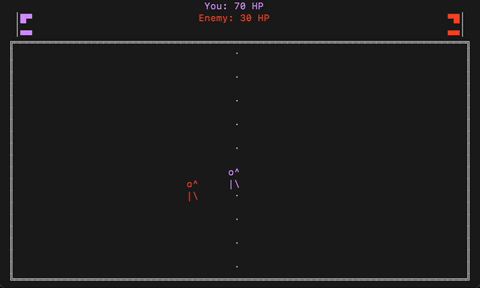

# duel

an online, sword-fighting duel in the terminal.



## Install

```bash
brew tap clarkfannin/duel
brew install duel
```

## How to Play

Run `duel` to connect to the online server and get matched with another player:

```bash
duel
```

### Controls

- `WASD` - Move around
- `Space` - Swing your sword
- `Q` - Quit

### Other Options

Host your own local server for LAN play:

```bash
duel host
```

Join a specific server:

```bash
duel join ws://localhost:8080
```

## Building from Source

```bash
go build -o duel .
```

## License

MIT
